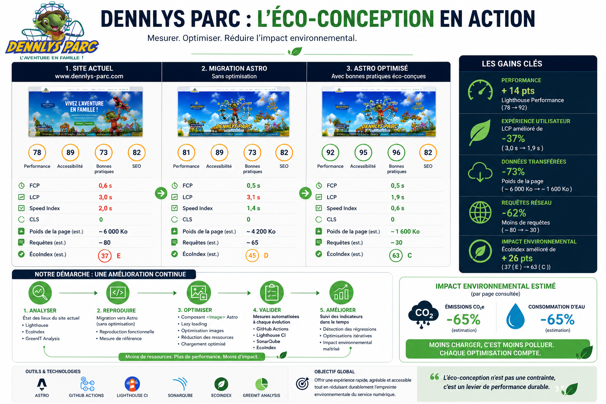

# Dennlys Parc - Reproduction et Optimisation Eco-Conception (Astro)

## Contexte
Ce projet reproduit la page d'accueil de `dennlys-parc.com` dans Astro, puis applique des optimisations de performance et d'eco-conception sans casser l'identite visuelle.

## Projet deploye
- https://dennlys-parc-digital-ecodesign-audi.vercel.app/

## Document final de l'etude (objectif principal)
Le document `eco-action.png` est considere comme le livrable final principal de l'etude.



## Objectifs
- Conserver un rendu visuel tres proche du site source.
- Ameliorer les scores Lighthouse (surtout Performance).
- Reduire l'empreinte EcoIndex via:
  - moins de poids au chargement initial,
  - moins de JavaScript execute au demarrage,
  - moins de requetes critiques.

## Etat actuel
- Clone de la home integre dans Astro avec assets locaux (`public/assets`, `public/utils`, `public/date.js`).
- Police originale (`GROBOLD`) integree localement.
- Refactor structurel en composants Astro (`src/components/home/*`).
- Compression build active (gzip + brotli) + compression HTML.

## Optimisations deja appliquees (axe EcoIndex)
1. **Compression de sortie**
- `astro.config.mjs` active `compressHTML`.
- `vite-plugin-compression` genere `.gz` et `.br`.

2. **Reduction du cout initial de la page**
- Script inline horaires externalise (`home-hours.js`).
- Script scroll externalise (`home-scroll-effects.js`).

3. **Deferral des contenus lourds tiers**
- Le bloc Facebook inline volumineux a ete retire du HTML initial.
- Le feed Facebook est charge a la demande via:
  - `public/assets/js/home-facebook-feed.js`
  - `public/assets/data/facebook-feed.html`
- Le script `cff.js` n'est plus charge globalement au boot, mais uniquement quand la section Facebook devient visible.

4. **Deferral newsletter**
- Le formulaire Mailjet est charge uniquement a l'approche de la section via `home-newsletter.js`.

## Architecture
```text
src/
  components/home/
    HomeLayout.astro
    HomeBot.astro
    HomeHeader.astro
    HomeMain.astro
    HomeFooter.astro
  pages/
    index.astro
  styles/
    home.scss

public/
  assets/
    css/
    js/
    data/
    images/
    fonts/
    video/
  utils/fbfeed/
  date.js
  manifest.json
```

## Branches Git
- `main`: base clone de la home.
- `optimisation`: travaux d'optimisation Lighthouse / EcoIndex.

## Commandes utiles
```bash
pnpm install
pnpm dev
pnpm build
pnpm preview
```

## Mesure et suivi qualite
### Lighthouse local
Le projet contient `.lighthouserc.json` (desktop) pour verifier les categories principales.

### Cibles recommendees (ordre prioritaire)
1. Performance Lighthouse >= 90
2. Diminution du poids initial HTML/JS/CSS
3. Limitation des scripts tiers en chemin critique
4. Stabilite visuelle (CLS) et vitesse d'affichage (LCP)

## Prochaines etapes d'optimisation (proposees)
1. Migrer les images critiques de la hero vers `astro:assets` (`<Image />`) avec dimensions explicites.
2. Ajouter des placeholders/squelettes pour Facebook/Newsletter (meilleure perception UX).
3. Etendre la logique "load on visible" aux autres integrations tierces non critiques.
4. Mettre en place une comparaison automatisee des scores Lighthouse avant/apres (CI).

## Contraintes projet
- Priorite: maintenir le rendu visuel du site d'origine.
- Les optimisations se font de maniere progressive et reversible (commits atomiques).
